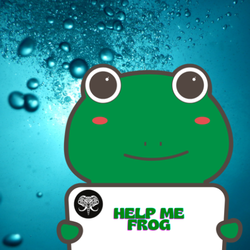
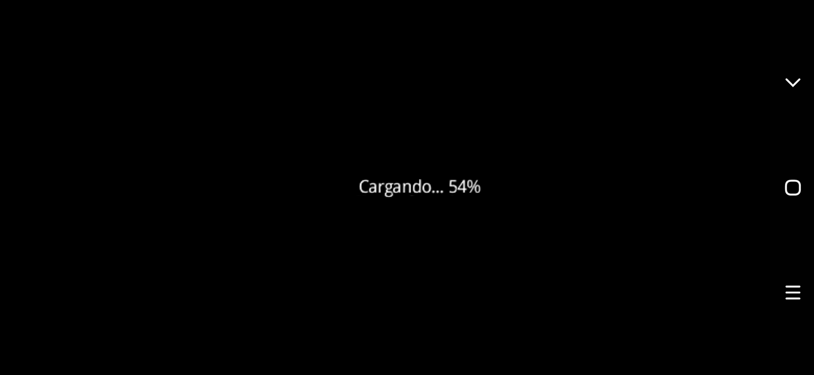
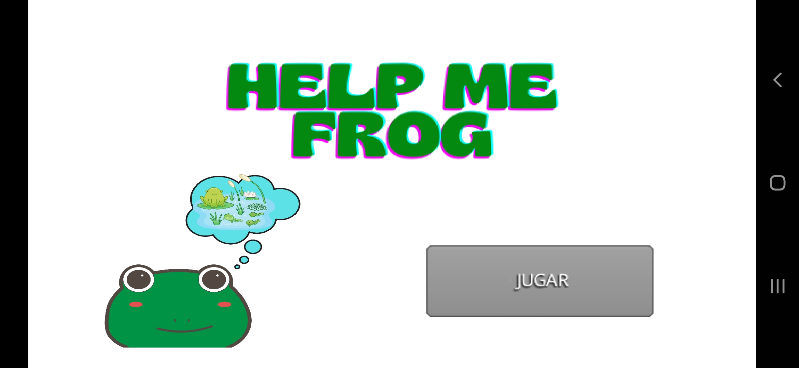
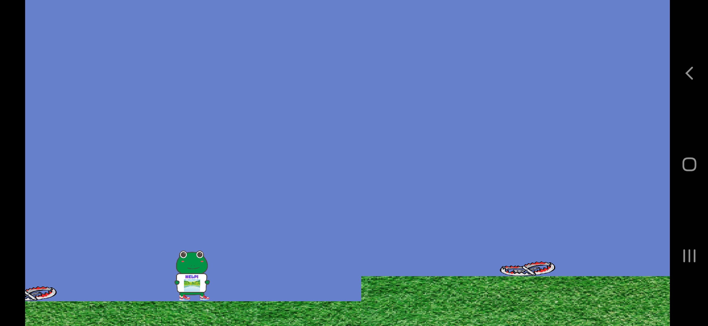
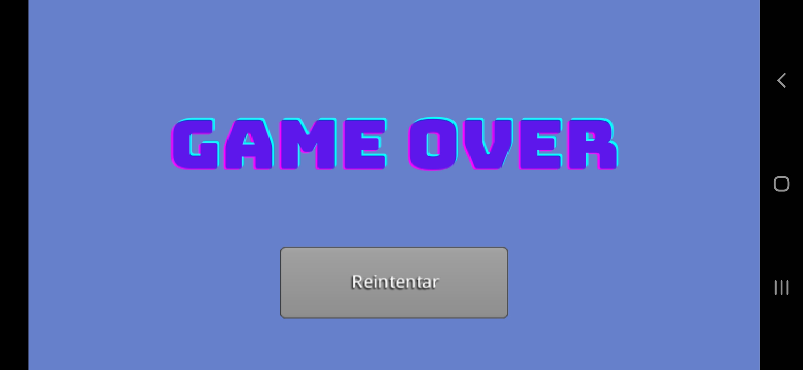

## **VIDEOJUEGO HELP ME FROG**

### Introducción

Este es un videojuego creado con LibGDX (<https://libgdx.com/>), librería basada en OpenGL muy utilizada para la creación de videojuegos multiplataforma. Actualmente este videojuego se encuentra en desarrollo (cada que tengo tiempo libre :D).

Se ha probado exitosamente en PC y en dispositivos Android.

### Disponibilidad

Para su correcta ejecución simplemente descargar todo el código de este repositorio, cargarlo en Android Studio (preferiblemente) y ejecutar (puede ser tanto en la PC como en dispositivos Android, este último con un rango de API desde la 14 [Ice cream Sandwich] a la 30 [Android 11]).

### Resultados

Los resultados hasta el momento son los siguientes:

- Ventana carga de elementos

- Ventana principal

- Nivel 1

- Ventana Game Over

#### **NOTAS**

* Contiene Bugs
* En desarrollo